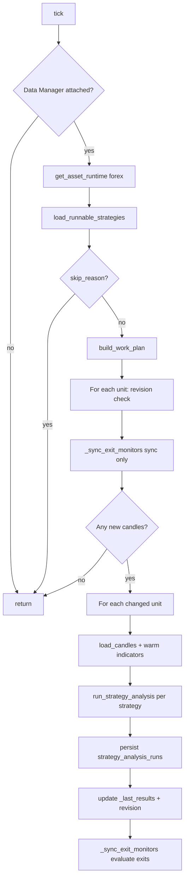

# Data Analyzer

The **Data Analyzer** bot (`data_analyzer`) runs strategy signal evaluation on cached OHLCV bars. It reacts when the Data Manager upserts a **new closed candle**, persists each analysis run to MongoDB, keeps in-memory results for the Executor, and monitors **open trades** for exit conditions via parallel sub-analyzers.

The orchestrator calls `tick()` every ~5 seconds, but **analysis only runs when `latest_candle_time` changes** for a work unit — most ticks are no-ops.

See also: [Orchestrator and bot loops](./orchestrator-and-bot-loops.md), [Data Manager](./data-manager.md).

## Role in the system

```
Data Manager (MongoDB) ──► DataAnalyzerBot.tick
                                    │
                    ┌───────────────┼───────────────┐
                    ▼               ▼               ▼
           run_strategy_analysis   strategy_analysis_runs   _last_results (memory)
                    │                                       │
                    │                                       ▼
                    │                              ExecutorBot.tick
                    ▼
           _TradeExitAnalyzer (open trades) ──► TradesRepository.close_trade
```

| Responsibility | Owner |
|----------------|-------|
| When to analyze | `DataAnalyzerBot` + `GLOBAL_CANDLE_REVISIONS` |
| Work grouping | `build_work_plan` (`trading/work_plan.py`) |
| Signal + filters | `run_strategy_analysis` (`trading/pipeline.py`) |
| Indicator reuse | `IndicatorCache` |
| Exit monitoring | `_TradeExitAnalyzer` + exit monitor registry |
| Downstream handoff | `get_recent_results()` → Executor |

## Module layout

| File / area | Purpose |
|-------------|---------|
| `bots/data_analyzer/bot.py` | `DataAnalyzerBot` — main tick, exit monitor sync |
| `bots/data_analyzer/sub_analyzer.py` | `SubAnalyzer` ABC for per-trade monitors |
| `trading/asset_runtime.py` | `ForexRuntime` — load strategies, build work plan |
| `trading/work_plan.py` | Group strategies by `(timeframe, pair)` → `WorkUnit` |
| `trading/candle_revision.py` | Skip unchanged `(pair, timeframe)` |
| `trading/candle_context.py` | `load_candles_for_unit` → Data Manager |
| `trading/pipeline.py` | `run_strategy_analysis`, logging |
| `trading/indicator_cache.py` | Warm EMA/SMA/RSI/ADX/ATR once per unit |
| `trading/registries/signals.py` | Pluggable signal evaluators |
| `trading/registries/filters.py` | Pluggable filter chain |
| `trading/registries/exits.py` | Pluggable exit monitor factories |
| `db/repositories/strategy_analysis_runs.py` | Persist live analysis runs |

## Dependencies

The orchestrator wires these at startup:

1. **`attach_data_manager(service)`** — required. Without it, every tick logs `"Data Manager not attached"` and returns.
2. **`data_manager` bot enabled** — must populate MongoDB before analysis can run.
3. **Forex asset runtime** — `get_asset_runtime("forex")` must be registered (default in `asset_runtime.py`).
4. **Runnable strategies** — same rules as Data Manager: enabled strategies with forex pairs overlapping Settings → Broker.

The Executor attaches to the analyzer instance (`executor.attach_data_analyzer`) to read `_last_results`; the analyzer does not call the executor directly.

## Lifecycle

### `on_start`

Logs startup. Trading registries (signals, filters, exits) are lazily registered on first `run_strategy_analysis` via `ensure_trading_registries()`.

### `run_startup_pass`

Called once by the orchestrator **after** `data_manager.tick()` on startup:

```python
await self.tick()
```

Ensures cached bootstrap candles are analyzed immediately instead of waiting for the first revision change.

### `on_stop`

Logs shutdown. In-memory state (`_last_results`, `_sub_analyzers`, indicator cache) is discarded.

### `status`

Extends base bot status with:

| Field | Meaning |
|-------|---------|
| `last_run_at` | UTC timestamp of last tick that produced at least one analysis |
| `recent_results_count` | Size of in-memory `_last_results` map |
| `data_manager_attached` | Whether `attach_data_manager` was called |
| `last_analyzed_candles` | Snapshot of `GLOBAL_CANDLE_REVISIONS` (`pair\|timeframe` → latest bar time) |

## Core types

### `WorkUnit`

One analysis bucket: a **pair + timeframe** with all strategies that share it.

| Field | Meaning |
|-------|---------|
| `pair` | e.g. `EUR/USD` |
| `asset_class` | `forex` (extensible via asset runtimes) |
| `timeframe` | e.g. `M15` |
| `bar_count` | Max bars needed by any strategy on this unit |
| `strategies` | Tuple of strategy documents to evaluate |

Built by `build_work_plan()`: merges enabled strategies × matched pairs, deduplicates strategies per `(timeframe, pair)`, takes max `bar_count`.

### `AnalysisResult`

Output of one strategy evaluation on one pair:

| Field | Meaning |
|-------|---------|
| `strategy_id`, `strategy_name`, `pair`, `timeframe` | Identity |
| `direction` | `long`, `short`, or `None` if filtered out / no signal |
| `confidence` | 0.0–1.0; zeroed when filters fail |
| `signal_type` | From strategy params (e.g. EMA crossover preset) |
| `min_candles` | Bars required for signal validity |
| `metadata` | Signal details, filter pass/fail, errors |
| `analyzed_at` | UTC evaluation time |
| `run_id` | MongoDB document id after persist |

Stored in `_last_results` keyed by `(strategy_id, pair)` — **one latest result per strategy/pair**, overwritten on each new candle.

## The tick loop (`DataAnalyzerBot.tick`)



### Step 1 — Preconditions

- `_data_manager` must be set.
- `get_asset_runtime("forex")` must exist.

### Step 2 — Load strategies and work plan

`ForexRuntime.load_runnable_strategies()` delegates to `load_runnable_forex_strategies()` (same as Data Manager):

- Enabled strategies from MongoDB.
- Forex enabled in asset settings with overlapping pairs.

If `skip_reason` is set (e.g. `"no enabled strategies"`), tick logs and returns.

`build_work_plan(strategies, asset_class="forex")` produces `WorkPlan.units`. Empty plan → return.

### Step 3 — Candle revision gate

For each `WorkUnit`:

1. `data_manager.latest_candle_time(pair, timeframe, source=OANDA)`.
2. `GLOBAL_CANDLE_REVISIONS.has_changed(pair, timeframe, latest_time)`.

If the latest bar time equals what was last analyzed, the unit is **skipped**. This is the primary cost control: between M15 closes, ticks do almost nothing.

**First run:** no prior revision → `has_changed` is true → unit is analyzed (see startup tests).

### Step 4 — Sync exit monitors (pre-analysis)

`_sync_exit_monitors(work_plan.units)` without `evaluate_pairs`:

1. Load open trades from `TradesRepository`.
2. Match each trade to a `WorkUnit` by pair and strategy id.
3. Create `_TradeExitAnalyzer` sub-analyzers for new trades; remove stale ones.
4. **Does not evaluate** yet — only maintains the monitor map.

### Step 5 — Analyze changed units

For each unit in `units_with_new_candles`:

1. **Load candles** — `load_candles_for_unit(unit, service=data_manager, requester="data_analyzer")`.
2. **Warm indicators** — `IndicatorCache.warm(pair, timeframe, candles, [strategy_params(s) for s in unit.strategies])`. Computes only indicators referenced in strategy params (signal indicators + filter periods).
3. **Per strategy** — `run_strategy_analysis(strategy, pair, candles, cache, timeframe=unit.timeframe)`.
4. **Persist** — `StrategyAnalysisRunsRepository.insert_from_result(analysis, candle_time=latest_time)`; set `analysis.run_id`.
5. **Log** — `log_analysis_result(analysis)` (structured INFO line).
6. **Memory** — `_last_results[(strategy_id, pair)] = analysis`.
7. **Revision** — `GLOBAL_CANDLE_REVISIONS.mark_updated(pair, timeframe, latest_time)`.

If any unit was analyzed, `_last_run_at` is set.

### Step 6 — Evaluate exit monitors (post-analysis)

`_sync_exit_monitors(work_plan.units, evaluate_pairs=evaluated_pairs)`:

- Runs `evaluate()` in parallel (`asyncio.gather`) only for sub-analyzers whose `(pair, timeframe)` was just analyzed.
- Each `_TradeExitAnalyzer` reloads candles, warms indicators, runs the exit monitor, and may call `TradesRepository.close_trade`.

## Strategy analysis pipeline

`run_strategy_analysis()` in `trading/pipeline.py`:

1. **`ensure_trading_registries()`** — registers presets (e.g. EMA crossover signal + exit factory).
2. **`strategy_params(strategy)`** — normalized params from preset schema.
3. **Signal** — `get_signal_evaluator(signal_type).evaluate(candles, params, indicators)` → direction + confidence + metadata.
4. **Filters** — `run_filter_chain(filters, candles, indicators, direction)`:
   - Disabled filters skipped (count as pass).
   - If any enabled filter fails → `direction = None`, `confidence = 0.0`.
5. **Return** `AnalysisResult`.

Unknown signal types produce a zero-confidence result with `metadata.error = "unknown_signal_type"`.

## Exit monitoring (`SubAnalyzer`)

`SubAnalyzer` is an abstract per-trade worker. The only implementation today is **`_TradeExitAnalyzer`**:

| Step | Action |
|------|--------|
| Create | `create_exit_monitor(trade, params)` from exit registry (EMA crossover registers `EmaCrossoverExitFactory`) |
| Evaluate | Load candles (`requester="data_analyzer_exit"`), warm indicators, `monitor.evaluate(...)` |
| Exit | If `ExitIntent` returned → `TradesRepository.close_trade(trade_id, reason, metadata)` |

Sub-analyzers are keyed by **trade id**. They are recreated when a new open trade appears and removed when the trade closes or no longer matches a work unit.

Exit evaluation is tied to **new candle events** on the trade’s pair/timeframe, not every 5s tick.

## Persistence

### `strategy_analysis_runs` collection

Each live analysis inserts a document via `analysis_result_to_document()`:

- Strategy/pair/timeframe, direction, confidence, signal_type, metadata
- `candle_time` — bar that triggered the run
- `analyzed_at` — evaluation timestamp
- `run_type`: `"live"`
- `execution`: `null` until Executor updates it

The Executor later calls `update_execution(run_id, {...})` with gates, priority, and intent details.

### In-memory `_last_results`

The Executor reads **`get_recent_results()`** — the latest `AnalysisResult` per `(strategy_id, pair)`. This is the handoff buffer between analyzer and executor ticks; it is not a full history (history is in MongoDB).

## Candle revision tracker

`GLOBAL_CANDLE_REVISIONS` (`CandleRevisionTracker`) is process-global state:

```python
has_changed(pair, timeframe, latest_time)  # True if latest != last analyzed
mark_updated(pair, timeframe, latest_time) # After successful analysis
```

Survives across ticks within one orchestrator process. Restart clears revisions → startup pass re-analyzes current latest bars.

Exposed in bot status as `last_analyzed_candles` for debugging.

## Indicator cache

`IndicatorCache` stores computed series per `(pair, timeframe)` key:

- Parses `params.indicators` and filter specs (ADX, ATR, RSI) to determine needed series.
- Recomputes on each analysis when candles change (same tick warms once per unit for all strategies on that unit).
- `IndicatorCacheView` is passed read-only into signal/filter/exit evaluators.

## Consumers and producers

| Component | Interaction |
|-----------|-------------|
| **Data Manager** | Supplies `latest_candle_time` and `request_candles` |
| **Executor** | Reads `get_recent_results()`; dedupes by `analyzed_at` |
| **Web / Strategy Analysis UI** | Reads `strategy_analysis_runs` via API (historical runs) |
| **Trades** | Exit path closes trades in MongoDB |

## Configuration and requirements

| Requirement | Notes |
|-------------|-------|
| `enabled_bots` includes `data_analyzer` | Bot must be in orchestrator |
| `data_manager` enabled and attached | Hard dependency |
| Enabled forex strategies + broker settings | Same as Data Manager |
| OANDA candles in MongoDB | Analyzer does not call OANDA directly |

## Running in development

There is no dedicated `brokerai run data-analyzer` shortcut in all setups; typical dev patterns:

```bash
# Full pipeline (recommended)
brokerai run orchestrator

# Or run data manager + analyzer via dev loops in separate terminals
brokerai run data-manager
# analyzer needs orchestrator wiring for attach_data_manager + executor
```

The analyzer alone without orchestrator attachment will not receive `DataManagerService` unless you instantiate and wire bots manually.

Unit tests: `tests/test_data_analyzer_startup.py` — revision gating, startup pass, candle change detection.

## Example timeline (M15 strategy)

| Time | Event |
|------|-------|
| Startup | Data Manager bootstraps EUR/USD M15; analyzer startup pass analyzes through latest bar; revision marked |
| T+5s … T+14m | Ticks: revision unchanged → `"no new candles to analyze"` |
| M15 close | Data Manager upserts new bar; `latest_candle_time` advances |
| Next analyzer tick | Revision changed → load candles → run strategies → persist runs → update `_last_results` |
| Same tick / next executor tick | Executor sees new `analyzed_at` → gates → queues intents |
| Open trade on EUR/USD M15 | Sub-analyzer created; on next new M15 bar, exit monitor may close trade |

## Related docs

- [Orchestrator and bot loops](./orchestrator-and-bot-loops.md) — tick scheduling and startup pass order
- [Data Manager](./data-manager.md) — candle cache that feeds the analyzer
- [Strategy params schema](../strategies/params-schema.md) — signals, filters, indicators, exits
- README — sub-bot taxonomy and `enabled_bots`
