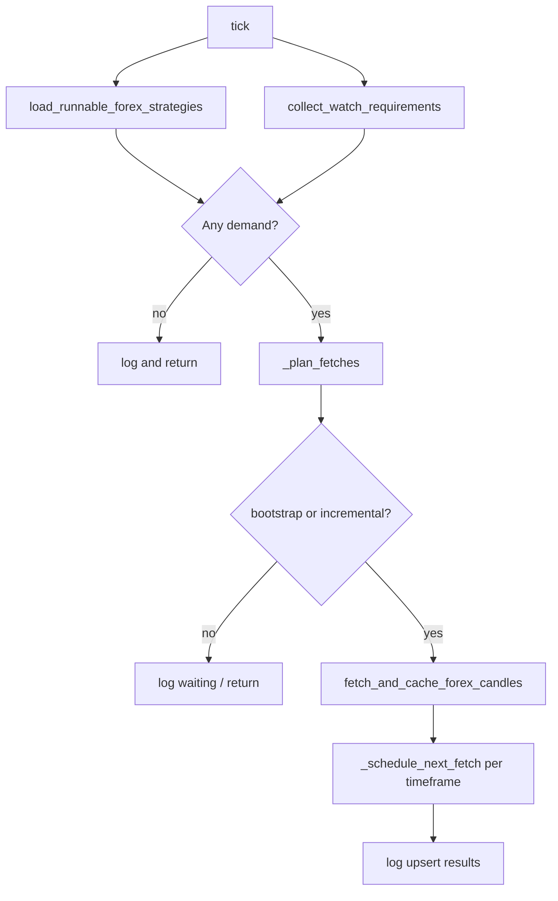

# Data Manager

The **Data Manager** bot (`data_manager`) is BrokerAI’s forex OHLCV cache layer. It decides which pairs and timeframes need data, schedules fetches around candle closes, pulls closed bars from OANDA, and upserts them into MongoDB. Other components read candles through `DataManagerService` rather than calling OANDA directly.

The orchestrator calls `tick()` every ~5 seconds, but **OANDA is only contacted when bootstrap or an incremental fetch is due** — not on every tick.

See also: [Orchestrator and bot loops](./orchestrator-and-bot-loops.md), [Caching strategy](./caching.md).

## Role in the system

```
Enabled strategies ──┐
Explore chart watches ──┼──► DataManagerBot.tick ──► OANDA API
On-demand consumers ──┘              │
                                     ▼
                            MongoDB market_data
                                     │
              ┌──────────────────────┼──────────────────────┐
              ▼                      ▼                      ▼
      data_analyzer            executor (gates)        Web Explore UI
```

| Responsibility | Owner |
|----------------|-------|
| When to fetch | `DataManagerBot` (`_plan_fetches`, `_next_fetch_at`) |
| How to fetch / upsert | `CandleCache` (`src/brokerai/trading/data/candle_cache.py`) |
| Public read API | `DataManagerService` (`service.py`) |
| Strategy-driven demand | `collect_candle_requirements` |
| UI-driven demand | `candle_watch` collection + `collect_watch_requirements` |

## Module layout

All bot logic lives under `src/brokerai/bots/data_manager/`:

| File | Purpose |
|------|---------|
| `bot.py` | `DataManagerBot` — tick loop, fetch planning, schedule state |
| `service.py` | `DataManagerService` — gateway for consumers; demand tracking |
| `candles.py` | Bootstrap detection, batched OANDA sync via `fetch_and_cache_forex_candles` |
| `candle_requirements.py` | `CandleRequirement` dataclass; merge strategy needs by timeframe |
| `candle_schedule.py` | Next candle close time; `is_candle_fetch_due` |
| `candle_watch.py` | Load active Explore watches from MongoDB |
| `forex_strategies.py` | Which enabled strategies need forex candles |

Persistence and OANDA HTTP live in `src/brokerai/trading/data/candle_cache.py` and `src/brokerai/db/repositories/market_data.py`.

## Lifecycle

### `on_start`

1. Registers this bot’s `DataManagerService` as the process-global service (`set_data_manager_service`).
2. Other bots and the web app resolve candles via `get_data_manager_service()` / `require_data_manager_service()`.

### `on_stop`

Clears the global service pointer so standalone/dev callers get an ephemeral service if needed.

### `status`

Extends the base bot status with:

- **`next_candle_fetches`** — per-timeframe UTC timestamp when the next incremental fetch is scheduled (`_next_fetch_at`). If nothing has been fetched yet, falls back to `next_candle_close_at` for timeframes in `candle_default_timeframes`.
- **`registered_demand`** — symbol/timeframe/source/bar_count pairs recorded when consumers call `request_candles` or `ensure_coverage`.

Inspect via `brokerai bots list --json` or `heartbeat.json`.

## The tick loop (`DataManagerBot.tick`)

Each orchestrator tick runs this pipeline:



### Step 1 — Load strategy demand

`load_runnable_forex_strategies()` (`forex_strategies.py`):

1. Load all **enabled** strategies from MongoDB.
2. Require **forex enabled** in Settings → Broker with at least one enabled pair.
3. Filter strategies whose assigned forex pairs overlap enabled pairs.

Returns `ForexStrategyLoadResult` with either a list of `(strategy, matched_pairs)` or a `skip_reason` (e.g. `"no enabled strategies"`, `"forex is disabled"`).

If strategies are skipped but **watch requirements** or **registered demand** exist, the tick continues anyway (Explore charts can keep fetching without runnable strategies).

### Step 2 — Build `CandleRequirement` list

`collect_candle_requirements(strategies)` (`candle_requirements.py`):

- One requirement **per unique timeframe** (not per strategy).
- For each timeframe, merges all pairs and takes the **maximum** `bar_count` any strategy needs on that timeframe.
- `bar_count` comes from `required_candle_bars()` → `effective_min_candles` / strategy params (capped at 2000 by default).
- Warns on missing or OANDA-unsupported timeframes.

`CandleRequirement` fields:

| Field | Meaning |
|-------|---------|
| `timeframe` | e.g. `M15`, `H1`, `D1` |
| `pairs` | Tuple of forex pair symbols |
| `bar_count` | Minimum historical bars to retain |
| `incremental` | Set during planning — fetch only new closed bars |

### Step 3 — Load watch demand (Explore UI)

`collect_watch_requirements()` (`candle_watch.py`):

- Reads **`candle_watch`** documents touched within the last **300 seconds** (`DEFAULT_WATCH_MAX_AGE_SECONDS`).
- The web Explore page registers watches on each candle API call (`register_explore_watch` with requester `web_explore`).
- Merges by `(symbol, timeframe)`; minimum **50 bars** per watch.

This lets the data manager keep fetching pairs someone is viewing even when no strategy uses them.

### Step 4 — Early exit

If there are no strategy requirements, no watch requirements, and no **registered demand** (see below), the tick logs `"no candle requirements to fetch"` and returns.

### Step 5 — Plan fetches (`_plan_fetches`)

For each requirement (strategy + watch) and each **registered demand** entry, classify as:

| Class | Condition | OANDA call |
|-------|-----------|------------|
| **Bootstrap** | `count_candles(pair, tf) < bar_count` for any pair in requirement | Full history sync (`bar_count=…`) |
| **Incremental** | Cache satisfied; `now >= _next_fetch_at[timeframe]` | `incremental=True` (forward from latest bar) |
| **Waiting** | Cache satisfied; close time not yet due | None this tick |

Additional planning rules:

- First time a timeframe appears, `_schedule_next_fetch` sets `_next_fetch_at[timeframe]` and may queue an immediate incremental fetch.
- Bootstrap and incremental lists are merged into `to_fetch = bootstrap + incremental`.
- If `to_fetch` is empty, tick logs `"no candle fetches due"` and returns (common between candle closes).

### Step 6 — Fetch and cache

`fetch_and_cache_forex_candles(to_fetch, service=…)` (`candles.py`):

- Runs requirements **concurrently** (limit: `candle_sync_concurrency`, default **4**).
- Per pair in each requirement:
  - **Bootstrap:** `service.sync(pair, timeframe, bar_count=…)`
  - **Incremental:** `service.sync(pair, timeframe, incremental=True)`
- Logs upsert counts; collects per-pair errors without aborting other pairs.

### Step 7 — Reschedule

After a successful fetch pass, for each requirement in `to_fetch`:

```python
next_at = next_candle_close_at(now, requirement.timeframe)
self._next_fetch_at[requirement.timeframe] = next_at
```

The next incremental fetch waits until that candle boundary (+ 3 second buffer).

## Candle close scheduling

`candle_schedule.py` implements bar-boundary math in UTC:

- **`next_candle_close_at(now, timeframe)`** — when the **currently forming** bar closes, plus `CLOSE_BUFFER` (3 seconds) so OANDA marks the prior bar complete.
- **`is_candle_fetch_due(now, next_fetch_at)`** — true when `now >= next_fetch_at`.

Supported timeframes align with `TIMEFRAMES` in strategy params (minutes `M*`, hours `H*`, `D1`, `W1`, `MN`).

Example: with `M15`, after a fetch at 10:15:03 UTC, `_next_fetch_at["M15"]` might be 10:30:03 UTC. Ticks between 10:15 and 10:30 do not call OANDA for M15.

## Bootstrap vs incremental sync

Planning logic lives in the bot; OANDA/Mongo logic lives in `CandleCache.sync()`:

### Bootstrap (full / backfill)

When MongoDB has **fewer bars than required**:

- Empty cache → `fetch_candles` for `bar_count` closed bars.
- Partial cache → `fetch_candles_to` backward from earliest cached bar to fill the gap.

### Incremental

When cache count is sufficient and schedule is due:

- Read `latest_candle_time` from MongoDB.
- `fetch_candles_from` with `INCREMENTAL_BAR_COUNT = 2`.
- Upsert only bars with `time > latest_time` (avoids duplicating the forming bar).

`requirement_needs_bootstrap()` checks **any** pair in the requirement: if any pair is under `bar_count`, the whole requirement is treated as bootstrap for planning.

## DataManagerService

`DataManagerService` is the **only supported way** for other code to read candles in-process.

### Demand tracking

Every `request_candles` / `ensure_coverage` call records demand:

- Key: `(symbol, timeframe, source)`
- Tracks max `bar_count` and set of `requester` names

The bot’s `_plan_fetches` also iterates `registered_demand()` so on-demand pulls (executor, web) participate in the same schedule as strategies.

### Key methods

| Method | Behavior |
|--------|----------|
| `request_candles(...)` | Record demand → `ensure_coverage` → `read_candles` from MongoDB |
| `ensure_coverage(...)` | Sync if count low or cache not complete up to expected latest closed bar |
| `sync(...)` | Direct pass-through to `CandleCache.sync` |
| `latest_candle_time(...)` | Used by `data_analyzer` for revision gating |
| `backfill` / `verify` / `repair` | Maintenance APIs on `CandleCache` |

### Global accessor

- **`set_data_manager_service`** — called by bot on start/stop.
- **`require_data_manager_service`** — used by web routes and `load_candles_for_unit`; returns standalone service if orchestrator bot is not running (dev/web-only).

## MongoDB collections

| Collection | Purpose |
|------------|---------|
| `market_data` | OHLCV bars keyed by symbol, timeframe, source, open time |
| `candle_sync_state` | High-water mark, expected latest bar, last error per series |
| `candle_watch` | Active Explore/UI watches (`updated_at` for TTL) |
| `strategies` | Enabled strategies (input to requirements) |
| `asset_settings` | Forex enabled flag and enabled pairs |

`CandleCache.is_cache_complete_up_to` compares latest stored bar to **expected latest closed bar** (uses Massive FX market status when configured, else calendar logic in `market_calendar.py`).

## Web / Explore integration

When a user loads candles in **Explore**:

1. `GET /api/market-data/candles` calls `register_explore_watch` → upserts `candle_watch`.
2. `service.request_candles(..., requester="web_explore")` ensures cache coverage immediately.
3. On each data manager tick, `collect_watch_requirements` picks up watches touched in the last 5 minutes.
4. SSE delta stream (`/api/market-data/candles/stream`) touches the watch periodically so long-lived charts stay in the fetch plan.

The bot tick loop and the web API share the same `DataManagerService` when the orchestrator runs both web and bots in one deployment (typical LXC setup).

## Consumers

| Consumer | How it uses Data Manager |
|----------|---------------------------|
| **Orchestrator startup** | One `data_manager.tick()` before analyzer/executor startup passes |
| **data_analyzer** | `latest_candle_time` for revision checks; `load_candles_for_unit` → `request_candles` |
| **executor** | `_load_candles` → `request_candles` for AI confirmation |
| **Web Explore / backtesting charts** | REST + watch registration |

## Configuration

| Setting | Default | Effect |
|---------|---------|--------|
| `candle_default_timeframes` | `M15` | Fallback timeframes shown in status before first fetch |
| `candle_sync_concurrency` | `4` | Max parallel OANDA syncs per tick |
| `candle_sync_chunk_size` | `5000` | Max bars per OANDA range request chunk |
| `enabled_bots` | (see settings) | Must include `data_manager` for scheduled fetching |

**Runtime requirements:**

- OANDA credentials in Settings → Data Connections
- Forex enabled with pairs in Settings → Broker
- At least one enabled strategy **or** an active Explore watch **or** registered consumer demand

## Running in development

```bash
# Loop until Ctrl+C (5s interval, fetches only when due)
brokerai run data-manager

# Single planning + fetch pass
brokerai run data-manager --once
```

Without the orchestrator, `require_data_manager_service()` creates a standalone `DataManagerService` for web/dev, but **scheduled incremental fetches** only run when the `data_manager` bot tick loop is active.

## Example timeline (M15 strategy)

| Time | Event |
|------|-------|
| Startup | Orchestrator calls `data_manager.tick()` — bootstrap 500 bars for EUR/USD M15 |
| T+0 | `_next_fetch_at["M15"]` set to next M15 close + 3s |
| T+5s … T+14m | Ticks run `_plan_fetches` → **waiting** → no OANDA |
| M15 close + buffer | `is_candle_fetch_due` true → incremental sync → 1 new bar upserted → schedule next close |
| User opens Explore on GBP/USD H1 | Watch registered → H1 added to requirements on subsequent ticks |

## Related docs

- [Orchestrator and bot loops](./orchestrator-and-bot-loops.md) — how `tick()` is scheduled
- [Data Analyzer](./data-analyzer.md) — consumes cached candles for strategy analysis
- [Caching strategy](./caching.md) — MongoDB vs Redis, coordination
- [Strategy params schema](../strategies/params-schema.md) — `min_candles`, timeframes
- README — forex candle cache overview and env vars
